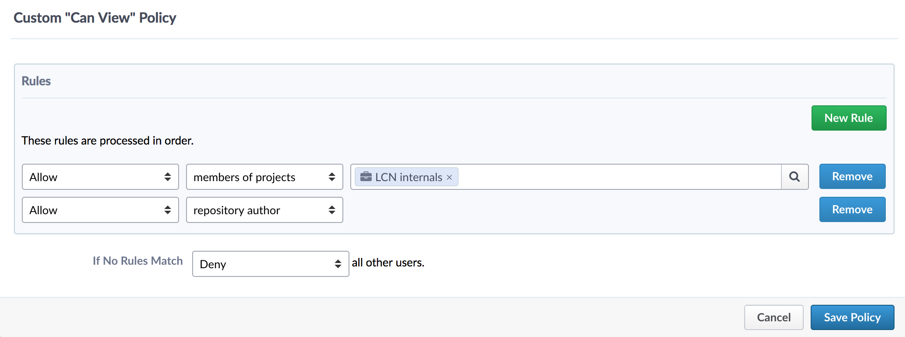

Coding and Software
===================

These guidelines describe general approaches to storing your scientific work, to help:

* Guarantee lab-internal transparency of ongoing projects
* Ensure code lifetime extends beyond the contracts of any single lab-member
* Facilitate reproducibility in the long run

Some of the below are lab-wide policies that should be followed. These are **marked in bold below**.

Code guidelines
---------------

Code should be stored in a **git repository on C4Science, accessible to the LCN group**. Please, exclude your data files from these repositories (see `Code vs Data`_).

* For each project that you develop code for, create a Git repository at https://c4science.ch 
* Make your Git repository readable for the members of the LCN-Internals project

  - Go to https://c4science.ch/diffusion/REPOSITORY_URL/manage/policies
  - Edit Policies -> "Visible to" -> Costum Policy
  - Make a Policy allowing members of LCN-Internals as well as "Repository Author", see the image below.

		
Code Quality
~~~~~~~~~~~~

Coming soon.

.. Commenting: How should comments be included in code written for lab software,
.. and to what standards?  Should docstrings be included?

.. Coding Standards: How do we shape our active lines of code in form and
.. function?

.. Using Other Code: Under what circumstances should code external to the lab be
.. used?  (i.e., both fundamental libraries like NumPy / LAPACK and higher-level
.. codes that build on them)  How should interactions between the lab and upstream
.. communities be managed  How should changes be contributed, which users should
.. issue those changes (i.e., lab organizations or individual users)?

.. Licensing: What licenses (permissive, open source) should be used?  For
.. examples of non-copyleft licenses, BSD, MIT, X11 and Apache are commonly used.
.. If copyleft licenses are to be used (which are sometimes discouraged by funding
.. agencies, and patent provisions may interfere with institutional policy) are
.. GPLv3, GPL2, GPL2+, MPL, AGPL to be used?  For hybrid models, is LGPL
.. appropriate?

.. Languages: What languages do we use in the lab?  Under what circumstances?
.. (i.e., "Python for most aspects of development, using C/C++ for underlying
.. performance improvement, with Node.js for web apps.")

.. Data Management: When data is utilized by the lab, how is it stored?  How are
.. files named?  Where would relational databases and their tables be stored?  Is
.. there a naming convention?  When data is generated, how is it stored?  How is
.. access to data managed (i.e., is data on a filesystem accessible to all members
.. of the lab?  Is there an assumption of privacy?)  Is data cataloged, are notes
.. kept, and how is the cataloging system handled?

.. IP/Openness: Is there an assumption that development occurs in public, in
.. private, or in a mixture?

.. Record Keeping: How do we record our actions?  Are there specific places that
.. the lab has access to, and is it something shared between lab members?  Are
.. notes open?

.. Reproducibility: How do we ensure our analyses are reproducible?

Data guidelines
---------------
* GIT HDFS
* Lab servers

Code vs Data
------------

In general, it is good practice to split your programming efforts into code and data.

Code
~~~~
Programs that perform simulations, do data analysis, plot your results, and so on. Importantly, code can consume data, i.e. if your code performs analyses of data files and plots something. It also can produce data. For example, if your code simulates a neuronal system it might produce spike times. Your code can also produce derivative data (e.g. rates from spikes) if it performs analyses.

Code files have the following properties:

* Small: commonly text (non-binary) files that require a minimal amount of storage
* Dependent on interpreter:  the syntax of your code will depend on whatever programming environment you write it for (e.g.: python, matlab, c, c++, perl, bash ...)
- Change often: Code will change often, e.g. as you need to implement a new functionality, fix a typo, add a comment.
- Suitable for versioned control: since the size of code files is small, incremental versions can be efficiently stored in version control systems (CVS). For example, this enables you to reproduce simulations or analyses that were produced with earlier versions of your code, even if you need to do this years later (given that you wrote down or annotated the of your code that was used).

Data
~~~~
Most generally, data are numbers that are stored in files according to certain formats. Formats can range from simple storing each number in a row of a text file, to more intricate data format standards.

Common examples for data formats are: plain text, CVS, HDF5.

Data files have the following properties:

* Large: Depending on the volume of data and its format, data files tend to use more space than code. 
* Independent of interpreter: data files can ideally be read from and written to by several interpreters, if general formats are used.
* Change rarely: most scientific data will usually be static, i.e. you will not change a single number here and there. If you often add measurements or simulations, this should produce additional data files.
* Not suitable for versioned control: due to the larger size of data files, they do not (or very rarely) lend themselves to versioned storage. On the bright side, data files also change rarely, and therefore do not benefit much from version control.
